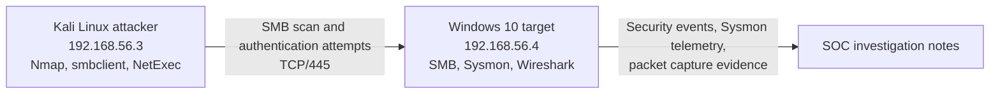

# Windows SMB Brute Force Detection Lab

This repository documents a small SOC investigation lab built to simulate, detect, and analyze an SMB brute force attack against a Windows endpoint. The lab uses Kali Linux as the attacker system and Windows 10 as the monitored host, with Sysmon, Windows Security logs, and Wireshark used as evidence sources.

The goal is to show the full analyst workflow: build the environment, generate controlled attack telemetry, investigate the activity, map it to MITRE ATT&CK, and document practical detection and hardening recommendations.

## Lab Summary

| Area | Detail |
| --- | --- |
| Scenario | SMB brute force against a Windows 10 host |
| Attacker | Kali Linux, `192.168.56.3` |
| Target | Windows 10, `192.168.56.4` |
| Primary service | SMB, `445/tcp` |
| Compromised account | `user1` |
| Confirmed password weakness | `123456` |
| Main evidence sources | Sysmon, Windows Security Event Log, Wireshark |
| Network | VirtualBox host-only network, `192.168.56.0/24` |

## Architecture



## What This Lab Demonstrates

- Building an isolated two-VM security lab for repeatable testing.
- Installing and validating Sysmon endpoint telemetry.
- Performing controlled SMB enumeration and password guessing from Kali.
- Detecting failed and successful network logons with Windows Event IDs `4625` and `4624`.
- Validating network behavior with Wireshark packet captures.
- Translating observed activity into MITRE ATT&CK techniques and detection logic.

## Key Findings

| Finding | Evidence |
| --- | --- |
| SMB was reachable on the Windows host | Nmap scan showed `445/tcp` open |
| Password guessing occurred | Repeated Windows Security Event ID `4625` failures |
| The account was compromised | Event ID `4624` success for `user1` after failed attempts |
| The attack originated from Kali | Source Network Address: `192.168.56.3` |
| Authentication was network-based | Logon Type `3`, consistent with SMB |
| Network capture supported the logs | Wireshark showed SMB and NTLMSSP traffic |

## Evidence Preview

| Evidence | Screenshot |
| --- | --- |
| Sysmon process telemetry |  |
| Nmap SMB scan |  |
| NetExec brute force output |  |
| Successful Windows logon |  |
| Wireshark SMB traffic |  |

## Documentation

| Document | Purpose |
| --- | --- |
| [Lab Setup Guide](docs/setup.md) | Build the Windows/Kali lab and configure telemetry |
| [Investigation Report](docs/investigation.md) | Walk through the attack timeline, evidence, and findings |
| [Detection Engineering Notes](detections/smb-bruteforce.md) | Detection logic, event fields, and triage workflow |
| [Evidence Index](docs/evidence-index.md) | Screenshot inventory and what each image proves |
| [Remediation Plan](docs/remediation.md) | Hardening steps and control recommendations |

## Repository Structure

```text
soc-sysmon-lab/
|-- README.md
|-- docs/
|   |-- setup.md
|   |-- investigation.md
|   |-- evidence-index.md
|   `-- remediation.md
|-- detections/
|   `-- smb-bruteforce.md
|-- configs/
|   `-- sysmonconfig-export.xml
`-- screenshots/
    `-- *.png
```

## Tools Used

| Tool | Role |
| --- | --- |
| Sysmon | Endpoint telemetry for process and network activity |
| Windows Event Viewer / PowerShell | Security log investigation for logon events |
| Wireshark | Packet-level validation of SMB and NTLM traffic |
| Nmap | Reconnaissance and service discovery |
| smbclient | SMB share enumeration |
| NetExec | Controlled SMB password guessing |

## MITRE ATT&CK Mapping

| Tactic | Technique | Lab Evidence |
| --- | --- | --- |
| Reconnaissance | T1595 - Active Scanning | Nmap SYN scan and Wireshark traffic |
| Discovery | T1135 - Network Share Discovery | SMB share enumeration |
| Credential Access | T1110 - Brute Force | Repeated Event ID `4625` failures |
| Initial Access | T1078 - Valid Accounts | Event ID `4624` successful network logon |

## Skills Highlighted

SOC analysis, Windows event log investigation, Sysmon telemetry validation, network packet analysis, detection engineering, MITRE ATT&CK mapping, incident documentation, and remediation planning.

## Safety Note

This lab was performed in an isolated host-only virtual network for educational and defensive training purposes only.
