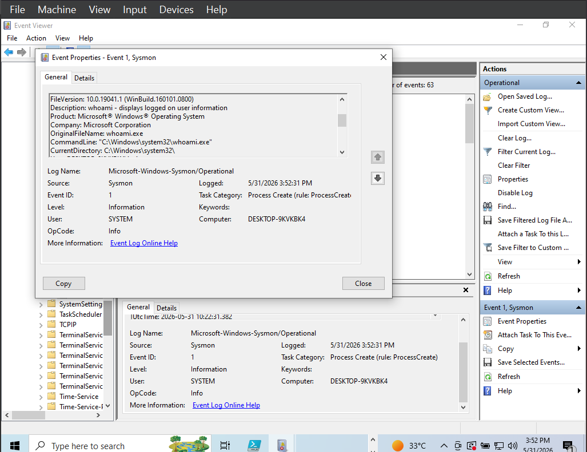
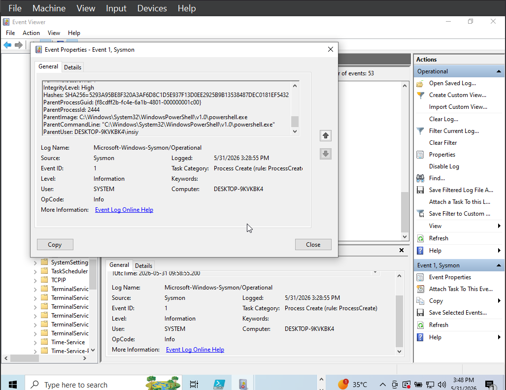
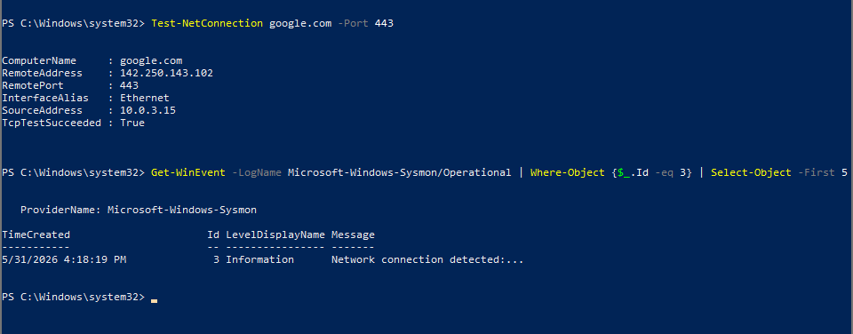
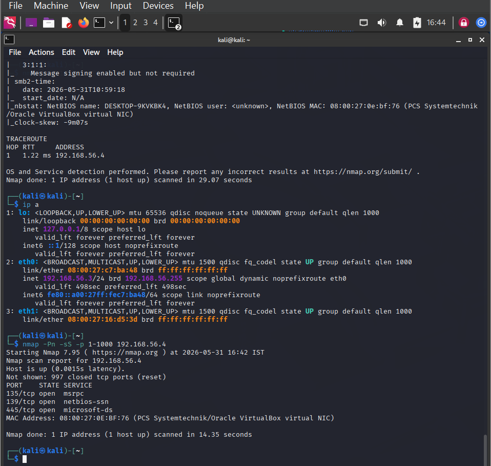
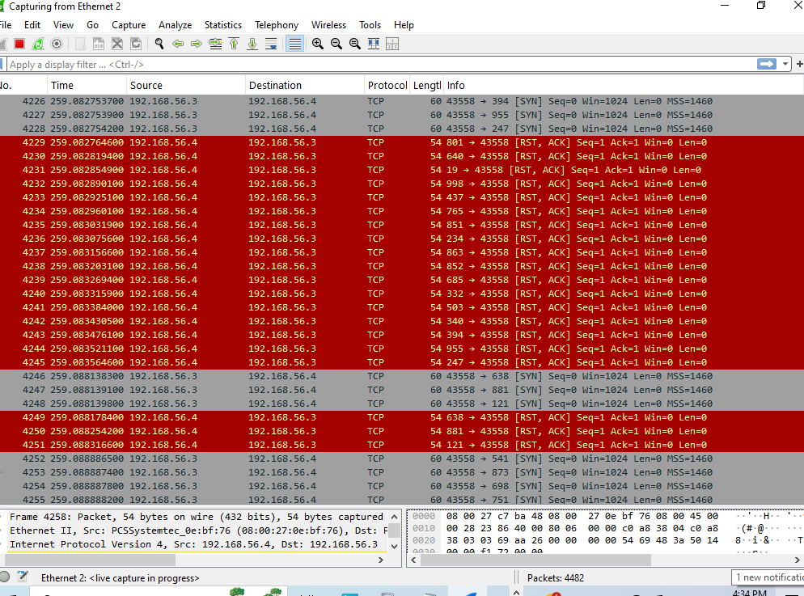
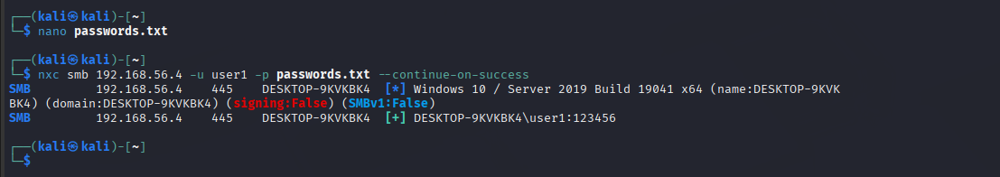
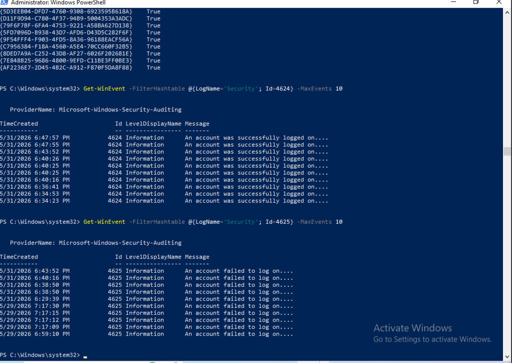
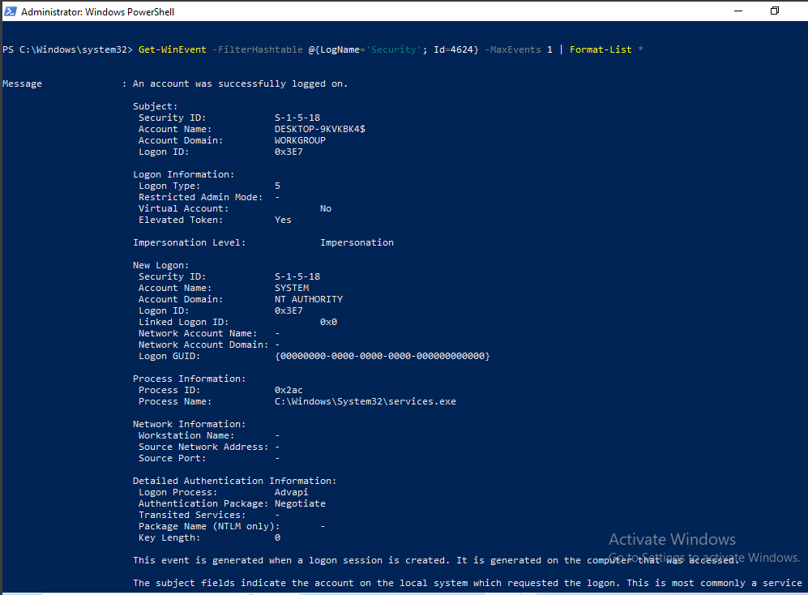
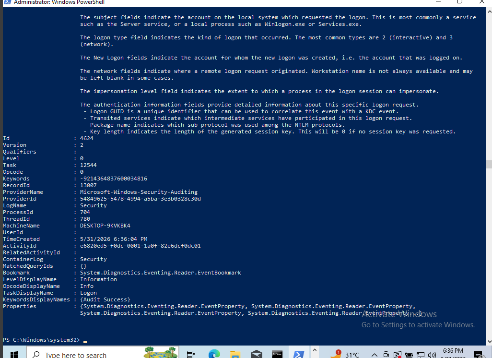
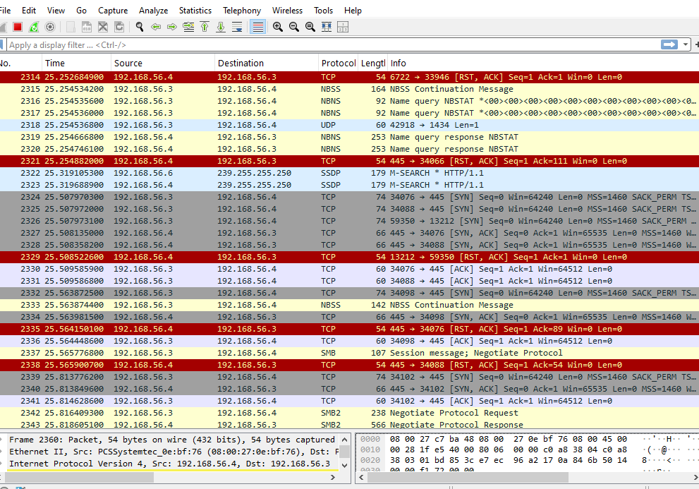

# Investigation Report: SMB Brute Force Attack

## Executive Summary

A Kali Linux host at `192.168.56.3` scanned a Windows 10 host at `192.168.56.4`, identified SMB exposure on TCP `445`, enumerated SMB access, and brute-forced the local account `user1`. Windows Security logs showed multiple failed authentication attempts followed by a successful network logon. Wireshark confirmed SMB and NTLM traffic between the same systems.

The activity is consistent with SMB password guessing followed by valid account use.

## Scope

| Item | Value |
| --- | --- |
| Target host | Windows 10, `192.168.56.4` |
| Attacker host | Kali Linux, `192.168.56.3` |
| Target protocol | SMB over TCP `445` |
| Account tested | `user1` |
| Evidence sources | Sysmon, Windows Security log, Wireshark |

## Timeline

| Phase | Activity | Evidence |
| --- | --- | --- |
| 1 | Baseline endpoint telemetry validation | Sysmon Event ID `1` and Event ID `3` |
| 2 | Port scan from Kali | Nmap output and Wireshark SYN traffic |
| 3 | SMB password guessing | NetExec output |
| 4 | Failed logon detection | Windows Security Event ID `4625` |
| 5 | Successful logon confirmation | Windows Security Event ID `4624` |
| 6 | Network validation | Wireshark SMB and NTLMSSP packets |

## Phase 1: Telemetry Validation

Before running the attack, normal commands were executed on the Windows host to confirm Sysmon was collecting process telemetry.

Sysmon Event ID `1` captured process creation, including command-line context:





Sysmon Event ID `3` validated network connection telemetry:



Analyst note: This baseline matters because it confirms the endpoint can produce evidence before suspicious activity begins.

## Phase 2: Reconnaissance

The attacker ran an Nmap scan from Kali:

```bash
nmap -Pn -sS -p 1-1000 192.168.56.4
```

Observed result: SMB-related ports were reachable, including TCP `445`.



Wireshark confirmed scan behavior from `192.168.56.3` to the Windows target:



## Phase 3: SMB Password Guessing

The attacker used NetExec to test passwords against the `user1` account:

```bash
nxc smb 192.168.56.4 -u user1 -p passwords.txt --continue-on-success
```

The output showed failed authentication attempts followed by a successful login using the weak password.



## Phase 4: Windows Log Detection

Failed logons were queried from the Windows Security log:

```powershell
Get-WinEvent -FilterHashtable @{LogName='Security'; Id=4625} -MaxEvents 10
```

Evidence:



Detection interpretation: Multiple Event ID `4625` failures from the same source against the same account in a short period indicate password guessing.

## Phase 5: Successful Compromise Confirmation

A successful logon was identified with Windows Security Event ID `4624`:

```powershell
Get-WinEvent -FilterHashtable @{LogName='Security'; Id=4624} -MaxEvents 1 | Format-List *
```



The key fields identified the source and logon type:



Important fields:

| Field | Value | Meaning |
| --- | --- | --- |
| Account Name | `user1` | Compromised local account |
| Logon Type | `3` | Network logon, consistent with SMB |
| Source Network Address | `192.168.56.3` | Attacker system |
| Authentication Package | NTLM | SMB authentication path |

## Phase 6: Packet Capture Validation

Wireshark independently confirmed SMB and NTLM authentication traffic between the attacker and target.



Network indicators:

| Indicator | Value |
| --- | --- |
| Source IP | `192.168.56.3` |
| Destination IP | `192.168.56.4` |
| Destination port | `445/tcp` |
| Protocols | TCP, SMB2, NTLMSSP |

## Indicators of Compromise

| Type | Value |
| --- | --- |
| Attacker IP | `192.168.56.3` |
| Target IP | `192.168.56.4` |
| Target port | `445/tcp` |
| Target account | `user1` |
| Failed logon event | Windows Security Event ID `4625` |
| Successful logon event | Windows Security Event ID `4624` |
| Suspicious pattern | Multiple `4625` events followed by `4624` from the same source |

## MITRE ATT&CK Mapping

| Technique | ID | Evidence |
| --- | --- | --- |
| Active Scanning | T1595 | Nmap scan and Wireshark SYN traffic |
| Network Share Discovery | T1135 | SMB enumeration phase |
| Brute Force | T1110 | Repeated Event ID `4625` failures |
| Valid Accounts | T1078 | Event ID `4624` successful network logon |

## Conclusion

The evidence supports a complete attack chain: reconnaissance, SMB exposure discovery, password guessing, and successful network authentication. The strongest detection is the correlation of repeated failed logons from `192.168.56.3` followed by Event ID `4624` Logon Type `3` for the same account.
