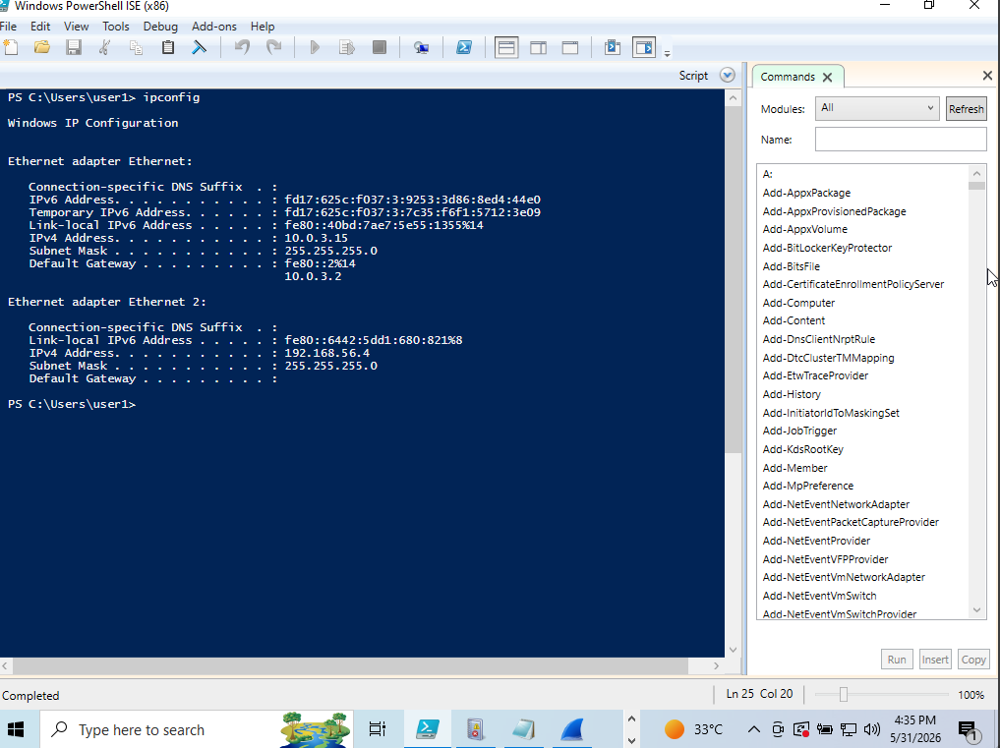
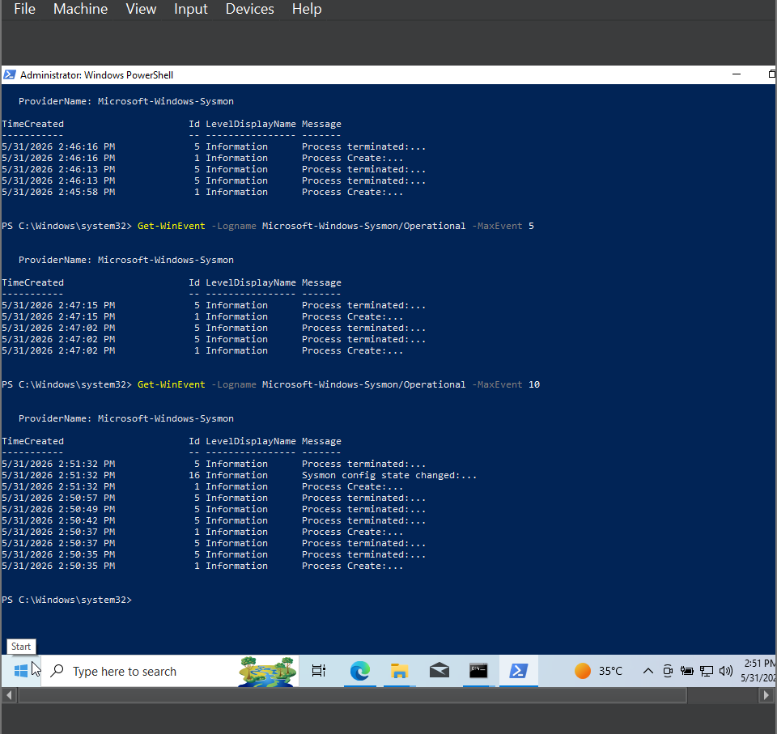
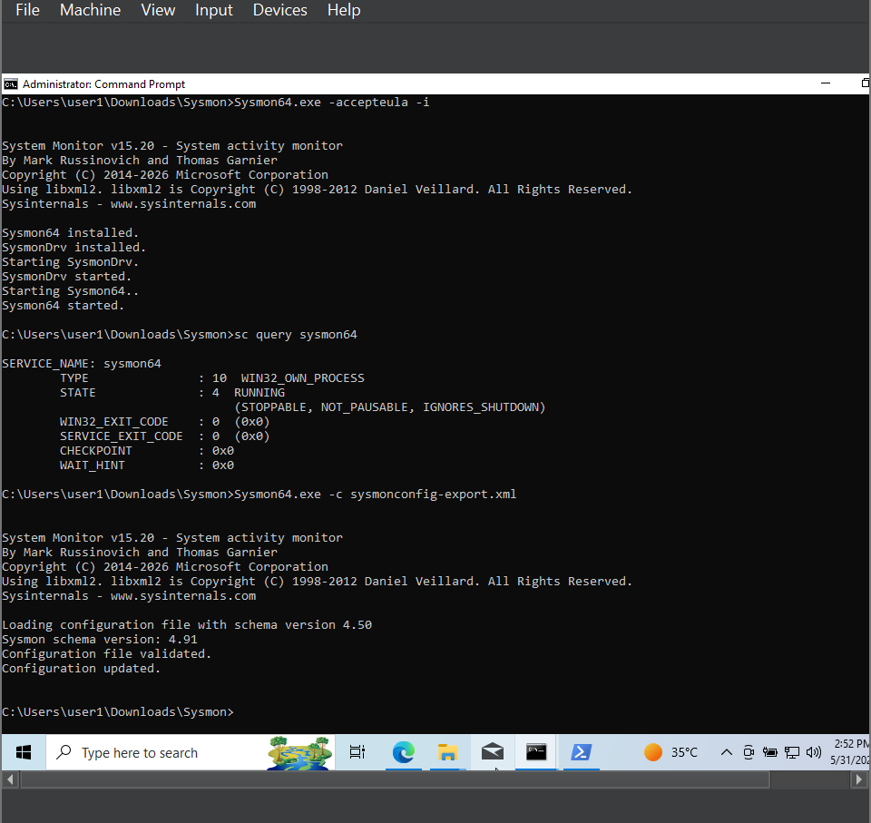
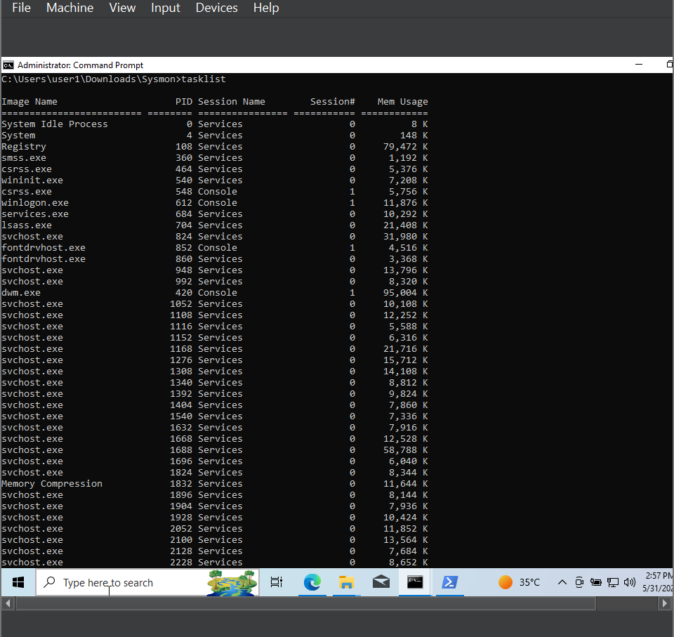
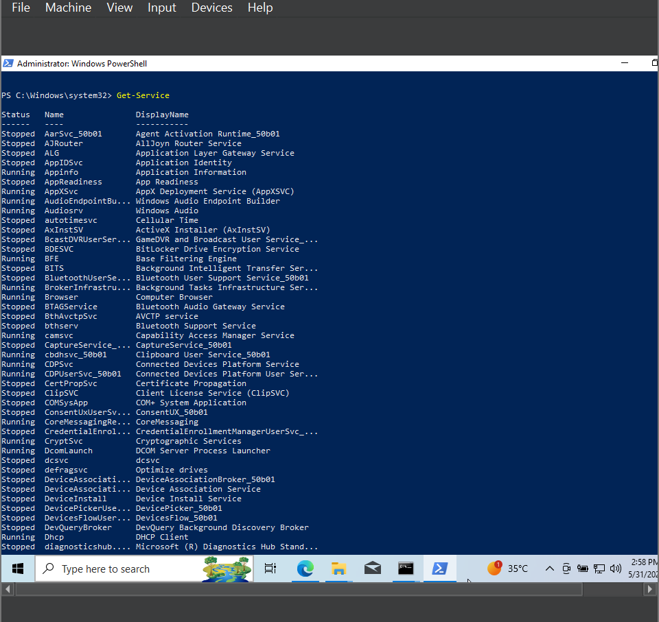
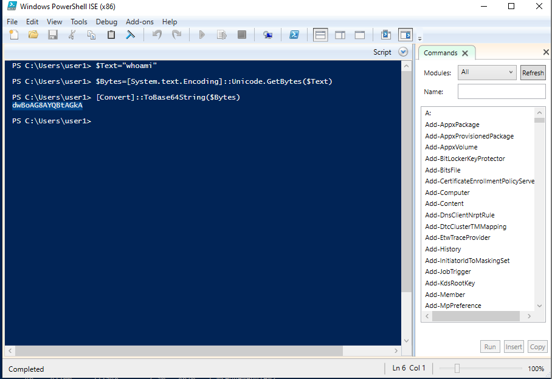

# Lab Setup Guide

This guide documents the environment used for the SMB password attack detection lab. The setup intentionally uses a host-only network so the attack traffic stays inside the local virtual lab.

## Requirements

| Component | Purpose |
| --- | --- |
| VirtualBox or VMware | Virtualization platform |
| Windows 10 VM | Monitored endpoint and SMB target |
| Kali Linux VM | Attacker and validation system |
| Sysmon | Endpoint telemetry |
| Wireshark | Packet capture |
| Nmap, smbclient, NetExec | Reconnaissance, enumeration, and controlled dictionary attack testing |

Recommended host resources: 8 GB RAM or more and at least 60 GB free disk space.

## Network Design

| System | IP Address | Role |
| --- | --- | --- |
| Kali Linux | `192.168.56.3` | Attacker |
| Windows 10 | `192.168.56.4` | Target and monitored endpoint |
| Network | `192.168.56.0/24` | VirtualBox host-only network |

Create a host-only network and disable DHCP so both VMs use static addresses.

1. Open VirtualBox Host Network Manager.
2. Create or select a host-only adapter.
3. Set the network to `192.168.56.0/24`.
4. Disable DHCP.
5. Attach both VMs to the same host-only adapter.

## Windows 10 Target

Assign the static IP address:

```text
IP address: 192.168.56.4
Subnet:    255.255.255.0
Gateway:   Not required for host-only testing
```

Validation evidence:



Create a local test account for the lab:

```cmd
net user user1 123456 /add
```

Create a test SMB share:

```cmd
md C:\LabShare
net share LabShare=C:\LabShare /grant:everyone,full
```

Enable logon auditing:

```cmd
auditpol /set /subcategory:"Logon" /success:enable /failure:enable
```

## Sysmon Installation

Download Sysmon from Microsoft Sysinternals and install it as Administrator:

```cmd
Sysmon64.exe -accepteula -i
```

Apply the included configuration:

```cmd
Sysmon64.exe -c configs\sysmonconfig-export.xml
```

The included XML is based on the public SwiftOnSecurity Sysmon configuration and is kept in this repo so the lab can be reproduced with the same telemetry assumptions.

Confirm the service is installed and running:

```cmd
sc query sysmon64
```

Confirm Sysmon events are being generated:

```powershell
Get-WinEvent -LogName Microsoft-Windows-Sysmon/Operational -MaxEvents 5
```

Validation evidence:





## Wireshark Capture

Install Wireshark on the Windows VM and start a capture on the host-only network adapter before running attacker activity.

Useful filters:

```text
tcp.port == 445
ip.addr == 192.168.56.3
ip.addr == 192.168.56.4
```

## Kali Linux Attacker

Assign the static IP address:

```text
IP address: 192.168.56.3
Subnet:    255.255.255.0
Gateway:   Not required for host-only testing
```

Verify required tools:

```bash
nmap --version
smbclient --version
nxc --version
```

Test reachability to the Windows host:

```bash
ping 192.168.56.4
```

## Baseline Telemetry Checks

Run a few normal commands on Windows before the attack to validate process telemetry:

```cmd
whoami
ipconfig
tasklist
```

```powershell
Get-Service
```

Evidence:







## Troubleshooting

| Problem | Likely Cause | Fix |
| --- | --- | --- |
| Kali cannot reach Windows | VM network mismatch | Confirm both VMs use the same host-only adapter |
| No `4625` events appear | Logon failure auditing disabled | Run the `auditpol` command from this guide as Administrator |
| Sysmon events are missing | Sysmon not installed or config not applied | Check `sc query sysmon64` and reapply the config |
| Wireshark misses SMB traffic | Capture started late or wrong adapter selected | Start capture before testing and select the host-only adapter |
| SMB is unreachable | Windows firewall or sharing disabled | Confirm file sharing rules and TCP `445` access in the lab network |
